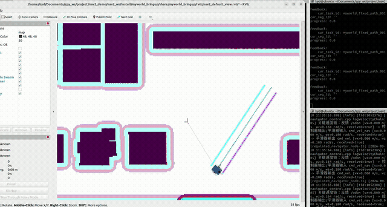
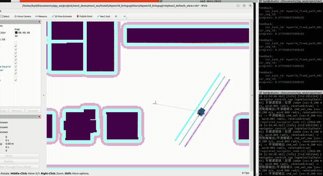
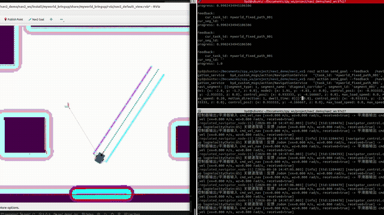

# mynavigation2

本仓库是 `nav2_demo` 项目的 Nav2 源码真源。当前推荐使用
`nav2_regulated_modules` 的统一入口，并在启动时选择互斥运行模式：

```text
nav2_regulated_modules/launch/regulated_modules.launch.py
  remote       人工键盘遥控
  autonomous   无行为树的自主规划、平滑与控制
  fixed_path   直接跟踪上游发布的完整路径
```

`myagv_test_bringup/launch/entry.launch.py` 继续保留为标准 BT Nav2 兼容入口。两个导航入口都面向
实车或板端运行，不启动 AMCL、`map2base_tf`、静态 `odom -> base_link` 或自定义
`laserpub`；定位、机器人 TF、雷达和里程计必须由外部系统提供。

快速启动推荐入口：

```bash
cd /home/byd/Documents/zpy_ws/project/nav2_demo/nav2_ws
source /opt/ros/humble/setup.bash
source install/setup.bash

ros2 launch nav2_regulated_modules regulated_modules.launch.py \
  operation_mode:=autonomous
```

将 `operation_mode` 改为 `remote` 或 `fixed_path` 即可进入另外两种模式。模式不能在运行中热
切换；必须先停止旧 Launch，再启动新模式。

## 安装依赖

以下命令适用于 Ubuntu 22.04 和 ROS 2 Humble。执行前需已配置 ROS 2 官方 apt 软件源。

安装 Nav2 运行依赖：

```bash
sudo apt update
sudo apt install ros-humble-navigation2 ros-humble-nav2-bringup
```

TEB Local Planner 还依赖 g2o：

```bash
sudo apt install ros-humble-libg2o
```

## 编译命令

所有编译命令都必须在 `nav2_ws` 工作空间执行，不要在 `navigation2` 源码仓库内直接编译。

首次编译或需要重建整个工作空间时：

```bash
cd /home/byd/Documents/zpy_ws/project/nav2_demo/nav2_ws
source /opt/ros/humble/setup.bash
export MAKEFLAGS="-j4"
colcon build --symlink-install --parallel-workers 1 --cmake-args -DBUILD_TESTING=OFF -DCMAKE_BUILD_TYPE=Release
colcon build --symlink-install --parallel-workers 1 --packages-select myagv_test_bringup --cmake-args -DBUILD_TESTING=OFF
```

编译 `myagv_test_bringup` 及工作空间内它依赖的包：

```bash
cd /home/byd/Documents/zpy_ws/project/nav2_demo/nav2_ws
source /opt/ros/humble/setup.bash
colcon build --symlink-install \
  --packages-up-to myagv_test_bringup \
  --cmake-args -DBUILD_TESTING=OFF -DCMAKE_BUILD_TYPE=Release
```

依赖已经编译完成，只重新编译 `myagv_test_bringup` 时：

```bash
cd /home/byd/Documents/zpy_ws/project/nav2_demo/nav2_ws
source /opt/ros/humble/setup.bash
source install/setup.bash
colcon build --symlink-install --packages-select myagv_test_bringup \
  --cmake-args -DBUILD_TESTING=OFF -DCMAKE_BUILD_TYPE=Release
```

只重新编译推荐入口及其仓库内依赖时：

```bash
cd /home/byd/Documents/zpy_ws/project/nav2_demo/nav2_ws
source /opt/ros/humble/setup.bash
source install/setup.bash
colcon build --symlink-install \
  --packages-up-to nav2_regulated_modules \
  --cmake-args -DBUILD_TESTING=OFF -DCMAKE_BUILD_TYPE=Release
```

编译完成后，在当前终端加载新的 install 空间：

```bash
source install/setup.bash
```

## 1. Nav2 数据流

本节对应保留的 `myagv_test_bringup` 标准 BT 入口；推荐的无 BT 三模式入口见第 4 节。当前默认 BT 将规划结果直接交给 FollowPath，没有自动调用 SmoothPath；`smoother_server` 虽已启动，是否执行路径平滑仍由实际 BT 决定。

标准 BT 默认运行链路：

```text
1. 地图
   maps/out.yaml
     -> map_server
     -> /map

2. 外部定位与机器人 TF
   localization system
     -> TF map -> base_link
   或
     -> TF map -> odom -> base_link

3. 激光雷达
   c200 lidar driver
     -> /c200_lidar_node/scan
     -> global_costmap / local_costmap obstacle layer

4. 导航目标
   RViz Nav2 Goal 或上层系统
     -> /navigate_to_pose action
     -> bt_navigator

5. 全局规划
   planner_server
     -> global_costmap + /map + TF
     -> nav_msgs/Path

6. 局部控制
   controller_server
     -> local_costmap + path + TF
     -> /cmd_vel_nav

7. 速度平滑
   velocity_smoother
     -> /cmd_vel

8. 底盘输出
   controlpub
     -> /control_to_uart
     -> chassis driver
     -> robot motion
```

## 2. 控制器配置

当前 `myagv_test_bringup/params/nav2_params.yaml` 加载多个控制器：

```text
DWB
RPP
MPPI
GracefulController
RotationShimController
```

默认选择：

```yaml
bt_navigator:
  ros__parameters:
    selected_controller: "DWB"
```

切换控制器时，只改 `selected_controller`，取值必须来自：

```yaml
controller_server:
  ros__parameters:
    controller_plugins:
      - DWB
      - RPP
      - MPPI
      - GracefulController
      - RotationShimController
```

建议：

- `DWB`：当前默认控制器，适合传统采样轨迹和 critic 调试。
- `RPP`：适合实车低速路径跟踪。
- `MPPI`：计算量更大，适合局部轨迹优化实验。
- `RotationShimController`：适合先对齐路径方向再跟踪。
- `GracefulController`：适合验证平滑几何控制。

## 3. 启动后检查

检查 TF：

```bash
ros2 run tf2_ros tf2_echo map base_link
```

检查雷达：

```bash
ros2 topic echo /c200_lidar_node/scan --once
```

检查地图：

```bash
ros2 topic echo /map --once
```

检查速度输出：

```bash
ros2 topic echo /cmd_vel
```

检查生命周期：

```bash
ros2 lifecycle nodes
```

判断标准：

- `map -> base_link` 能持续查到。
- `/c200_lidar_node/scan` 有数据。
- 激光 `frame_id` 能接入 TF 树。
- `/map` 正常发布。
- 导航目标发送后 `/cmd_vel` 有输出。
- Nav2 lifecycle 节点进入 active 状态。

## 4. 推荐入口：nav2_regulated_modules 三模式运行

默认控制周期统一为 `100 Hz`（`10 ms`）：自主导航和固定路径的 Controller Server、
Velocity Smoother，以及键盘遥控和 `ChassisControl` 输出均使用这一频率。
速度、加减速度、jerk、位置容差及秒制超时保持原配置。固定路径起步限速解除采用
连续 `10` 个稳定周期，保留原先约 `0.1 s` 的名义稳定时间；目标检查器的
`position_stable_cycles` 配置为 `10`，但固定路径专用成功分支不调用该稳定计数方法，
不能把它解释成实际终点稳定等待。默认固定路径沿用 Controller Server 的
终点停车锁存、位置准确标志与停稳速度判定，不使用已撤销的连续 1 秒精度窗口或
3 秒终点超时；FollowPath 失败仍可进入原恢复流程。起点航向达标当周期
进入跟踪的 `alignment_stable_cycles: 1` 保持不变。
本地仿真 `/odom` 和由其逐条转换的 `/motion_state` 同步为 `100 Hz`；直接规控入口的
`/odometry`、`/motion_state` 由外部实车驱动发布，需要独立核对真实频率。

RPP 原地转向与 CLOSED_LOOP 速度平滑采用连续速度斜坡，并用实测速度按时间校正。
`RPP.rotate_to_heading_feedback_time` 和 `velocity_smoother.feedback_correction_time`
默认均为 `0.1 s`，必须为有限正数；它们控制反馈校正速度，不改变原速度与加减速度上限。
这避免底盘轻微跟踪误差与每周期增量叠加后，在升频时把可达到的速度压低。
OPEN_LOOP、死区累积、超时停车、全零立即停车与碰撞检查仍保留各自原有语义。

`nav2_regulated_modules` 不使用行为树，通过启动参数 `operation_mode` 在三种互斥模式中选择一种。
模式只能在启动时确定，不支持运行中热切换。切换模式时必须先停止旧 Launch，再启动新模式，避免旧
Action、速度命令或 Topic 发布者残留。

### 4.1 模式对照

| `operation_mode` | 上游输入 | 实际数据流 | 适用场景 |
| --- | --- | --- | --- |
| `remote` | 交互式终端键盘 | 键盘 → `myagv_keyboard_control` → `/control_to_uart` | 人工接管、底盘方向和串口联调 |
| `autonomous` | `/goal_pose`、`NavigateToPose`、`NavigateThroughPoses` | Planner → Smoother（默认启用）→ FollowPath（RPP）→ Velocity Smoother → Collision Monitor（默认启用）→ `controlpub` | 自主规划并实时导航 |
| `fixed_path` | `/navigation_service`，类型为 `byd_custom_msgs/action/NavigationService` | 业务分段 → Path 生成／校验 → FollowPath（`FixedPathController`）→ Velocity Smoother → Collision Monitor（默认启用）→ `controlpub` | 上游提供连续直线段或贝塞尔段 |

三种模式都只启动一个主控制链；`/control_to_uart` 仍需在现场核对实际发布者：

- `remote` 只启动 `myagv_keyboard_control`，不启动地图、规划、控制、速度平滑、RViz 和
  `controlpub`。
- `autonomous` 和 `fixed_path` 不启动 `myagv_keyboard_control`，由 `controlpub` 把
  `/cmd_vel` 转换为 `/control_to_uart`。
- `regulated_navigator` 内另有 `ChassisControlSubscriber`，订阅
  `/downstream/chassis_control` 并持有 `/control_to_uart` 发布器；该支路在检测到多个发布者时停止自身输出。
- `fixed_path` 为保持统一 Lifecycle 节点集合仍会启动 Planner Server 和 Smoother Server，但
  `regulated_navigator` 不会向它们发送规划或路径平滑 Goal。

### 4.2 运行前提与公共环境

`remote` 只需要可交互终端、键盘控制包和底盘通信链，不依赖地图、雷达、里程计或定位 TF。

`autonomous` 和 `fixed_path` 启动前必须确保：

- 外部定位能够持续提供 `map -> base_link` TF。
- 雷达发布 `/c200_lidar_node/scan`，类型为 `sensor_msgs/msg/LaserScan`，其 `frame_id` 能通过
  TF 接入 `base_link`。
- 里程计发布 `/odometry`，类型为 `nav_msgs/msg/Odometry`，供 Controller Server 和速度链诊断使用。
- 底盘反馈发布 `/motion_state`，类型为 `byd_custom_msgs/msg/MotionState`，其中 `v_car/w_car`
  供 CLOSED_LOOP Velocity Smoother 和独立底盘输入支路使用；两个反馈入口不能混为同一话题。
- 底盘控制节点能够接收 `/control_to_uart`。

每个终端先加载环境：

```bash
cd /home/byd/Documents/zpy_ws/project/nav2_demo/nav2_ws
source /opt/ros/humble/setup.bash
source install/setup.bash
export ROS_LOG_DIR=/tmp/nav2_logs
export SPDLOG_WRAPPER_LOG_DIR=/tmp/nav2_logs
```

`ROS_LOG_DIR` 和 `SPDLOG_WRAPPER_LOG_DIR` 必须指向可写目录。

### 4.3 Launch 参数

统一入口：

```bash
ros2 launch nav2_regulated_modules regulated_modules.launch.py \
  operation_mode:=autonomous
```

常用启动参数：

| 参数 | 默认值 | 说明 |
| --- | --- | --- |
| `operation_mode` | `autonomous` | 只能取 `remote`、`autonomous`、`fixed_path` |
| `map` | 包内 `maps/out.yaml` | 地图 YAML 绝对路径；只影响导航模式 |
| `params_file` | 包内 `params/regulated_modules.yaml` | 导航各节点及 Costmap 参数；remote 读取其中的 `myagv_keyboard_control` 块 |
| `use_sim_time` | `false` | 是否使用 `/clock` |
| `use_rviz` | `True` | 是否启动 RViz；遥控模式始终不启动 RViz |
| `rviz_config_file` | 包内 `rviz/nav2_default_view.rviz` | RViz 配置文件 |
| `autostart` | `true` | 是否由 Lifecycle Manager 自动激活节点 |
| `use_composition` | `False` | 是否把标准 Nav2 组件加载到已有组件容器 |
| `container_name` | `nav2_regulated_container` | 组合模式使用的外部组件容器名称 |
| `use_respawn` | `False` | 非组合模式下节点异常退出后是否重启 |
| `log_level` | `info` | ROS 日志等级 |
| `use_collision_monitor` | `true` | 导航模式启用碰撞速度保护；关闭后平滑器直接发布 `/cmd_vel` |
| `use_collision_visualization` | `true` | 导航模式显示碰撞区域，不参与速度判定 |
| `adaptive_goal_braking_enabled` | `false` | 固定路径可选自适应制动，默认不启用 |
| `fixed_path_progress_timeout` | `120.0` | 固定路径进度等待阈值，单位秒；不是单独的终点等待超时 |
| `enable_localization_jump_detection` | `false` | 是否在相邻 `map -> base_link` 位姿跳变超过阈值时取消控制并停车；不影响 TF 丢失超时停车 |
| `namespace` | 空 | 顶层命名空间 |
| `use_namespace` | `False` | 是否启用顶层命名空间 |
| `keyboard_input_device` | 当前 Shell 的 `/dev/pts/*` 或 `/dev/tty` | 遥控模式读取的终端设备 |

`operation_mode` 的命令行值会覆盖 YAML 中 `regulated_navigator.operation_mode`。定位跳变停车保护默认关闭，
需要恢复原行为时显式传入 `enable_localization_jump_detection:=true`；`map -> base_link` TF 丢失超时停车保护始终保留。
默认保持 `use_composition:=False`；启用组合模式前必须先准备与 `container_name` 一致的组件容器。

### 4.4 遥控模式

必须从能够接收键盘输入的交互式终端启动：

```bash
ros2 launch nav2_regulated_modules regulated_modules.launch.py \
  operation_mode:=remote
```

Launch 会自动把启动 Shell 的真实终端设备传给键盘节点。自动识别失败时显式指定：

```bash
tty
ros2 launch nav2_regulated_modules regulated_modules.launch.py \
  operation_mode:=remote \
  keyboard_input_device:=/dev/pts/N
```

统一三模式 Launch 读取 `params_file` 中的 `myagv_keyboard_control` 参数块，再覆盖终端设备和
输出话题，不读取键盘包独立的 `config/keyboard_control.yaml`。默认目标速度为 `linear_speed=1.0 m/s`、
`angular_speed=0.5 rad/s`，但 `max_linear_speed=0.3 m/s`、`max_angular_speed=0.3 rad/s` 同时约束
目标和最终输出，实际遥控上限均为 `0.3`；`command_timeout=0.10 s`。这些目标值、硬上限与
节点内置值是不同概念。自定义时修改传入的规控参数文件；另外两种键盘启动方式见第 6 节。

### 4.5 自主规划模式

启动完整自研自主链：

```bash
ros2 launch nav2_regulated_modules regulated_modules.launch.py \
  operation_mode:=autonomous \
  use_sim_time:=false \
  use_rviz:=True
```

无图形环境：

```bash
ros2 launch nav2_regulated_modules regulated_modules.launch.py \
  operation_mode:=autonomous \
  use_rviz:=False
```

数据流：

```text
/goal_pose／NavigateToPose／NavigateThroughPoses
  -> regulated_navigator
  -> ComputePathToPose／ComputePathThroughPoses
  -> SmoothPath
  -> FollowPath
  -> /cmd_vel_nav
  -> velocity_smoother
  -> /cmd_vel_collision_in
  -> collision_monitor（默认开启）
  -> /cmd_vel
  -> controlpub
  -> /control_to_uart
```

发送标准单点目标：

```bash
ros2 action send_goal /navigate_to_pose nav2_msgs/action/NavigateToPose "{
  pose: {
    header: {frame_id: 'map'},
    pose: {
      position: {x: 0.569, y: 0.541, z: 0.0},
      orientation: {x: 0.0, y: 0.0, z: 0.0, w: 1.0}
    }
  },
  behavior_tree: ''
}" --feedback
```

`behavior_tree` 必须为空；该入口不加载外部行为树 XML。RViz 的 `2D Goal Pose` 也可以通过
`/goal_pose` 进入相同的规划、平滑和控制链。

自主链的关键参数位于 `params/regulated_modules.yaml`：

| 参数路径 | 默认值 | 作用 |
| --- | --- | --- |
| `planner_server.selected_planner` | `GridBasedAstar` | Planner Server 最终采用的规划插件；非空时覆盖 Action 中的 `planner_id` |
| `regulated_navigator.planner_id` | `GridBasedAstar` | `regulated_navigator` 写入规划 Action Goal 的插件 ID |
| `regulated_navigator.controller_id` | `RPP` | 普通导航 FollowPath 使用的控制器插件 ID |
| `regulated_navigator.smoother_id` | `simple_smoother` | SmoothPath 使用的平滑器插件 ID |
| `regulated_navigator.use_smoother` | `true` | 是否执行规划后路径平滑 |
| `regulated_navigator.replan_frequency` | `1.0` | 控制期间周期重规划频率，单位 Hz |
| `regulated_navigator.feedback_frequency` | `5.0` | 外层导航 Action 反馈频率，单位 Hz |
| `regulated_navigator.max_recovery_rounds` | `2` | 清理双 Costmap 后重新规划的最大轮数 |
| `velocity_smoother.feedback` | `CLOSED_LOOP` | 用 `/motion_state` 实测速度按时间校正内部连续速度斜坡 |
| `controller_server.controller_frequency` | `100.0` | 控制循环目标频率，单位 Hz |
| `velocity_smoother.smoothing_frequency` | `100.0` | 平滑输出目标频率，单位 Hz |
| `velocity_smoother.feedback_correction_time` | `0.1` | 实测速度校正时间常数，单位秒 |
| `velocity_smoother.immediate_stop_on_zero_command` | `false` | 默认全零输入仍受平滑减速约束 |
| `velocity_smoother.max_velocity` | `[1.5, 0.0, 2.0]` | X、Y、Theta 三轴最大速度 |
| `velocity_smoother.max_accel` | `[2.5, 0.0, 3.2]` | X、Y、Theta 三轴最大加速度 |
| `velocity_smoother.max_decel` | `[-2.5, 0.0, -3.2]` | X、Y、Theta 三轴最大减速度 |

切换全局规划器时，应同时确认 `planner_server.planner_plugins` 已加载目标插件，并让
`planner_server.selected_planner` 与 `regulated_navigator.planner_id` 保持一致。切换控制器时，
目标 ID 必须存在于 `controller_server.controller_plugins`。这些参数由节点配置阶段读取，修改
YAML 后应重新启动 Launch。

当前已加载的规划器 ID 为 `GridBased`、`GridBasedAstar`、`Smac2D`、`SmacHybrid`、
`SmacLattice` 和 `ThetaStar`；控制器 ID 为 `DWB`、`RPP`、`FixedPathController`、`MPPI`、
`GracefulController` 和 `RotationShimController`。

### 4.6 固定路径模式

完整启动架构、模块职责、周期函数和任务细节见
[固定路径模式架构与调用链](nav2_regulated_modules/doc/fixed_path_architecture.md)。

终端一启动固定路径模式：

```bash
cd /home/byd/Documents/zpy_ws/project/nav2_demo/nav2_ws
source /opt/ros/humble/setup.bash
source install/setup.bash
ros2 launch nav2_regulated_modules regulated_modules.launch.py \
  operation_mode:=fixed_path \
  use_sim_time:=false \
  use_rviz:=True
```

终端二发送一条直线段，并持续显示整体进度反馈和最终结果：

```bash
cd /home/byd/Documents/zpy_ws/project/nav2_demo/nav2_ws
source /opt/ros/humble/setup.bash
source install/setup.bash
ros2 action send_goal /navigation_service \
  byd_custom_msgs/action/NavigationService \
  "{task_id: demo_line, navi_segment: [
    {segment_type: 1, node1: {x: 70.1, y: -12.4, z: 0.0}, node2: {x: 63.8, y: -12.1, z: 0.0}, control_pos1: {x: 0.0, y: 0.0, z: 0.0}, control_pos2: {x: 0.0, y: 0.0, z: 0.0}, motion_direction: 1, max_speed: 0.6}
  ]}" --feedback
```

#### 实车接口一致的 `myworld_bringup` 仿真

该仿真用于在接入实车前验证固定路径的方向、起终点朝向、速度符号和停车逻辑。`myworld_bringup` 使用
Gazebo 提供机器人、里程计和传感器数据，使用 AMCL 提供 `map` 坐标系定位；固定路径 Action、
`FixedPathController`、Controller Server 和 Velocity Smoother 与实车算法链保持一致。仿真最终通过
`/cmd_vel` 驱动 Gazebo，实车则由底盘适配链把控制结果送到 `/control_to_uart`，因此仿真验证不能替代
实车上的急停、通信、制动距离、定位质量和唯一控制发布者检查。

默认非组合仿真中，Controller Server 与 Velocity Smoother 的速度反馈均被包装入口重写为 `/odom`；
`odom_to_motion_state.py` 另将里程计逐条转换到 `/motion_state`，供底盘输入支路使用。
Gazebo 里程计发布、控制器和速度平滑器配置均为 100 Hz。仿真 fixed_path 包装入口还将
`immediate_stop_on_zero_command` 重写为 true；直接规控默认非自适应入口则为 false。
显式切换组合模式或其他参数文件时应核对最终节点参数，不只看原始 YAML。

隔离实验可显式传入 `params_file`、`map`、`world_file`；省略时使用原仓库参数与场景；fixed_path 默认使用新图，其他模式使用原图。

当前真实激光候选图已保存在 [myworld3](./myworld_bringup/models/myworld3/README.md)，按用户要求，`entry.launch.py operation_mode:=fixed_path` 默认地图已切换到 `myworld3/myworld3.yaml`，其他模式仍使用原图；显式 `map:=...` 优先。六处、十八个朝向的端点匹配诊断 P95 最大 30 mm，但原严格射线验收未通过；正确保留未知单元后的 0.2 m/s 停车回归为 1/2，倒车停后定位误差最大 12.31 mm。本次先切换固定路径地图，不将切换或 Action 成功写成全部验收通过。
终端一启动 Gazebo、AMCL、固定路径规控栈和 RViz：

```bash
ros2 launch myworld_bringup entry.launch.py operation_mode:=fixed_path use_rviz:=true
```

该仿真入口的 `use_collision_monitor` 默认 false；需要与本文直接规控入口的默认碰撞速度链一致时，
显式传入 `use_collision_monitor:=true`。无图形环境可以使用：

```bash
ros2 launch myworld_bringup entry.launch.py \
  operation_mode:=fixed_path headless:=true use_rviz:=false \
  use_collision_monitor:=true
```

终端二发送前进任务。控制器按起点横向和航向误差决定直接跟踪或先原地转向，再以正线速度跟踪；
终点按位置及停稳速度判定，不额外执行航向对齐：

```bash
ros2 action send_goal --feedback /navigation_service byd_custom_msgs/action/NavigationService "{task_id: 'myworld_fixed_path_001', navi_segment: [{segment_type: 1, segment_name: 'diagonal_corridor', segment_id: 'segment_001', node1: {x: -2.8, y: -1.7, z: 0.0}, node2: {x: 1.91, y: -4.83, z: 0.0}, control_pos1: {x: -0.933333, y: -2.933333, z: 0.0}, control_pos2: {x: 0.933333, y: -4.166667, z: 0.0}, max_load_speed: 0.0, max_speed: 0.20, motion_direction: 1, dwell_time: 0}]}"
```

前进仿真视频（约 63 秒）：

[](./vedio/forward.webm)

[直接播放或下载前进仿真视频](./vedio/forward.webm)

终端二发送后退任务。控制器按车体反向轴与起点切线的误差决定直接跟踪或先原地转向，再以负线速度沿
相同几何路径跟踪；终点同样不额外执行航向对齐：

```bash
ros2 action send_goal --feedback /navigation_service byd_custom_msgs/action/NavigationService "{task_id: 'myworld_fixed_path_001', navi_segment: [{segment_type: 1, segment_name: 'diagonal_corridor', segment_id: 'segment_001', node1: {x: -2.8, y: -1.7, z: 0.0}, node2: {x: 1.91, y: -4.83, z: 0.0}, control_pos1: {x: -0.933333, y: -2.933333, z: 0.0}, control_pos2: {x: 0.933333, y: -4.166667, z: 0.0}, max_load_speed: 0.0, max_speed: 0.20, motion_direction: 2, dwell_time: 0}]}"
```

后退仿真视频（约 32 秒）：

[](./vedio/back.webm)

[直接播放或下载后退仿真视频](./vedio/back.webm)

前进与后退连续仿真视频（约 272 秒）：

[](./vedio/backandforward.webm)

[直接播放或下载前进与后退连续仿真视频](./vedio/backandforward.webm)

这些视频是历史演示，时长不是当前 100 Hz 配置的性能或停车精度验收结果。

前进和后退示例必须分别从路径起点附近运行。完成其中一个任务后，如需验证另一个方向，应停止并重新启动
`myworld_bringup`，确认机器人重新位于 `node1=(-2.8,-1.7)` 附近后再发送 Goal。实车运行时不要启动
`myworld_bringup`；应启动 `nav2_regulated_modules` 的 `fixed_path` 模式，接入真实定位、TF、雷达、里程计
和底盘驱动，并确认 `/control_to_uart` 只有一个有效发布者。

#### 三段连续路径示例

以下 Goal 由“直线＋三次贝塞尔曲线＋直线”构成三段连续路径。第一段终点
`(14.8, -12.0)` 同时是曲线起点，曲线终点 `(17.9, -16.0)` 同时是第三段起点：

```bash
ros2 action send_goal /navigation_service \
  byd_custom_msgs/action/NavigationService \
  "{task_id: demo_three_segments, navi_segment: [
    {
      segment_type: 1,
      segment_name: line_1,
      segment_id: segment_1,
      node1: {x: 9.3, y: -12.0, z: 0.0},
      node2: {x: 14.8, y: -12.0, z: 0.0},
      control_pos1: {x: 0.0, y: 0.0, z: 0.0},
      control_pos2: {x: 0.0, y: 0.0, z: 0.0},
      motion_direction: 1,
      max_speed: 0.6
    },
    {
      segment_type: 2,
      segment_name: bezier_1,
      segment_id: segment_2,
      node1: {x: 14.8, y: -12.0, z: 0.0},
      node2: {x: 17.9, y: -16.0, z: 0.0},
      control_pos1: {x: 16.9, y: -12.0, z: 0.0},
      control_pos2: {x: 18.0, y: -13.9, z: 0.0},
      motion_direction: 1,
      max_speed: 0.6
    },
    {
      segment_type: 1,
      segment_name: line_2,
      segment_id: segment_3,
      node1: {x: 17.9, y: -16.0, z: 0.0},
      node2: {x: 17.9, y: -20.6, z: 0.0},
      control_pos1: {x: 0.0, y: 0.0, z: 0.0},
      control_pos2: {x: 0.0, y: 0.0, z: 0.0},
      motion_direction: 1,
      max_speed: 0.6
    }
  ]}" \
  --feedback
```

其中 `segment_type: 1` 表示直线段，`segment_type: 2` 表示依次经过
`node1/control_pos1/control_pos2/node2` 的三次贝塞尔段。

#### 4.6.1 指定直线段路径点簇

下面给出一条从 `(70.1, -12.4)` 到 `(63.8, -12.1)` 的固定直线段路径，坐标系为 `map`。线段长度约为
`6.307139 m`；按 `0.15 m` 间隔采样并强制包含终点后，共生成 44 个 Pose，最后一个补偿段约为
`0.007139 m`。所有 Pose 使用沿路径前进方向的统一朝向，`yaw=3.094010 rad`，对应四元数约为
`{x: 0.0, y: 0.0, z: 0.999717, w: 0.023789}`。

以下离散 Path 点簇是旧接口的几何说明，不再作为当前 Action 的可执行命令；当前接口只发送分段端点和控制点：

```bash
# 旧离散 Path 示例（仅供几何参考，不能直接发送给 NavigationService）
  "{path: {header: {frame_id: map}, poses: [
    {pose: {position: {x: 70.100000, y: -12.400000, z: 0.0}, orientation: {x: 0.0, y: 0.0, z: 0.999717, w: 0.023789}}},
    {pose: {position: {x: 69.950169779, y: -12.392865228, z: 0.0}, orientation: {x: 0.0, y: 0.0, z: 0.999717, w: 0.023789}}},
    {pose: {position: {x: 69.800339559, y: -12.385730455, z: 0.0}, orientation: {x: 0.0, y: 0.0, z: 0.999717, w: 0.023789}}},
    {pose: {position: {x: 69.650509338, y: -12.378595683, z: 0.0}, orientation: {x: 0.0, y: 0.0, z: 0.999717, w: 0.023789}}},
    {pose: {position: {x: 69.500679117, y: -12.371460910, z: 0.0}, orientation: {x: 0.0, y: 0.0, z: 0.999717, w: 0.023789}}},
    {pose: {position: {x: 69.350848897, y: -12.364326138, z: 0.0}, orientation: {x: 0.0, y: 0.0, z: 0.999717, w: 0.023789}}},
    {pose: {position: {x: 69.201018676, y: -12.357191366, z: 0.0}, orientation: {x: 0.0, y: 0.0, z: 0.999717, w: 0.023789}}},
    {pose: {position: {x: 69.051188455, y: -12.350056593, z: 0.0}, orientation: {x: 0.0, y: 0.0, z: 0.999717, w: 0.023789}}},
    {pose: {position: {x: 68.901358235, y: -12.342921821, z: 0.0}, orientation: {x: 0.0, y: 0.0, z: 0.999717, w: 0.023789}}},
    {pose: {position: {x: 68.751528014, y: -12.335787048, z: 0.0}, orientation: {x: 0.0, y: 0.0, z: 0.999717, w: 0.023789}}},
    {pose: {position: {x: 68.601697793, y: -12.328652276, z: 0.0}, orientation: {x: 0.0, y: 0.0, z: 0.999717, w: 0.023789}}},
    {pose: {position: {x: 68.451867573, y: -12.321517503, z: 0.0}, orientation: {x: 0.0, y: 0.0, z: 0.999717, w: 0.023789}}},
    {pose: {position: {x: 68.302037352, y: -12.314382731, z: 0.0}, orientation: {x: 0.0, y: 0.0, z: 0.999717, w: 0.023789}}},
    {pose: {position: {x: 68.152207131, y: -12.307247959, z: 0.0}, orientation: {x: 0.0, y: 0.0, z: 0.999717, w: 0.023789}}},
    {pose: {position: {x: 68.002376911, y: -12.300113186, z: 0.0}, orientation: {x: 0.0, y: 0.0, z: 0.999717, w: 0.023789}}},
    {pose: {position: {x: 67.852546690, y: -12.292978414, z: 0.0}, orientation: {x: 0.0, y: 0.0, z: 0.999717, w: 0.023789}}},
    {pose: {position: {x: 67.702716469, y: -12.285843641, z: 0.0}, orientation: {x: 0.0, y: 0.0, z: 0.999717, w: 0.023789}}},
    {pose: {position: {x: 67.552886249, y: -12.278708869, z: 0.0}, orientation: {x: 0.0, y: 0.0, z: 0.999717, w: 0.023789}}},
    {pose: {position: {x: 67.403056028, y: -12.271574097, z: 0.0}, orientation: {x: 0.0, y: 0.0, z: 0.999717, w: 0.023789}}},
    {pose: {position: {x: 67.253225807, y: -12.264439324, z: 0.0}, orientation: {x: 0.0, y: 0.0, z: 0.999717, w: 0.023789}}},
    {pose: {position: {x: 67.103395587, y: -12.257304552, z: 0.0}, orientation: {x: 0.0, y: 0.0, z: 0.999717, w: 0.023789}}},
    {pose: {position: {x: 66.953565366, y: -12.250169779, z: 0.0}, orientation: {x: 0.0, y: 0.0, z: 0.999717, w: 0.023789}}},
    {pose: {position: {x: 66.803735146, y: -12.243035007, z: 0.0}, orientation: {x: 0.0, y: 0.0, z: 0.999717, w: 0.023789}}},
    {pose: {position: {x: 66.653904925, y: -12.235900235, z: 0.0}, orientation: {x: 0.0, y: 0.0, z: 0.999717, w: 0.023789}}},
    {pose: {position: {x: 66.504074704, y: -12.228765462, z: 0.0}, orientation: {x: 0.0, y: 0.0, z: 0.999717, w: 0.023789}}},
    {pose: {position: {x: 66.354244484, y: -12.221630690, z: 0.0}, orientation: {x: 0.0, y: 0.0, z: 0.999717, w: 0.023789}}},
    {pose: {position: {x: 66.204414263, y: -12.214495917, z: 0.0}, orientation: {x: 0.0, y: 0.0, z: 0.999717, w: 0.023789}}},
    {pose: {position: {x: 66.054584042, y: -12.207361145, z: 0.0}, orientation: {x: 0.0, y: 0.0, z: 0.999717, w: 0.023789}}},
    {pose: {position: {x: 65.904753822, y: -12.200226372, z: 0.0}, orientation: {x: 0.0, y: 0.0, z: 0.999717, w: 0.023789}}},
    {pose: {position: {x: 65.754923601, y: -12.193091600, z: 0.0}, orientation: {x: 0.0, y: 0.0, z: 0.999717, w: 0.023789}}},
    {pose: {position: {x: 65.605093380, y: -12.185956828, z: 0.0}, orientation: {x: 0.0, y: 0.0, z: 0.999717, w: 0.023789}}},
    {pose: {position: {x: 65.455263160, y: -12.178822055, z: 0.0}, orientation: {x: 0.0, y: 0.0, z: 0.999717, w: 0.023789}}},
    {pose: {position: {x: 65.305432939, y: -12.171687283, z: 0.0}, orientation: {x: 0.0, y: 0.0, z: 0.999717, w: 0.023789}}},
    {pose: {position: {x: 65.155602718, y: -12.164552510, z: 0.0}, orientation: {x: 0.0, y: 0.0, z: 0.999717, w: 0.023789}}},
    {pose: {position: {x: 65.005772498, y: -12.157417738, z: 0.0}, orientation: {x: 0.0, y: 0.0, z: 0.999717, w: 0.023789}}},
    {pose: {position: {x: 64.855942277, y: -12.150282966, z: 0.0}, orientation: {x: 0.0, y: 0.0, z: 0.999717, w: 0.023789}}},
    {pose: {position: {x: 64.706112056, y: -12.143148193, z: 0.0}, orientation: {x: 0.0, y: 0.0, z: 0.999717, w: 0.023789}}},
    {pose: {position: {x: 64.556281836, y: -12.136013421, z: 0.0}, orientation: {x: 0.0, y: 0.0, z: 0.999717, w: 0.023789}}},
    {pose: {position: {x: 64.406451615, y: -12.128878648, z: 0.0}, orientation: {x: 0.0, y: 0.0, z: 0.999717, w: 0.023789}}},
    {pose: {position: {x: 64.256621394, y: -12.121743876, z: 0.0}, orientation: {x: 0.0, y: 0.0, z: 0.999717, w: 0.023789}}},
    {pose: {position: {x: 64.106791174, y: -12.114609104, z: 0.0}, orientation: {x: 0.0, y: 0.0, z: 0.999717, w: 0.023789}}},
    {pose: {position: {x: 63.956960953, y: -12.107474331, z: 0.0}, orientation: {x: 0.0, y: 0.0, z: 0.999717, w: 0.023789}}},
    {pose: {position: {x: 63.807130732, y: -12.100339559, z: 0.0}, orientation: {x: 0.0, y: 0.0, z: 0.999717, w: 0.023789}}},
    {pose: {position: {x: 63.800000, y: -12.100000, z: 0.0}, orientation: {x: 0.0, y: 0.0, z: 0.999717, w: 0.023789}}}
  ]}}" --feedback
```

输入要求：

- Action 默认是 `/navigation_service`，可通过 `regulated_navigator.navigation_service_action` 修改。
- Goal 输入为 `string task_id` 和 `NaviSegment[] navi_segment`；几何形状由每段的 `segment_type`、`node1`、`node2`、`control_pos1`、`control_pos2` 决定，`motion_direction` 和 `max_speed` 另用于方向与速度控制。
- Feedback 为 `cur_task_id`、空的 `cur_seg_id` 和 `float32 progress`；`progress` 表示总路径完成比例，范围为 `0.0–1.0`。Result 为 `bool finish`。
- `segment_type=1` 为直线段，节点根据 `node1/node2` 自动生成共线控制点；`segment_type=2` 为三次贝塞尔段，依次使用 `node1/control_pos1/control_pos2/node2`。
- 所有坐标按 `global_frame` 解释且必须为有限值；相邻段的前段 `node2` 与后段 `node1` 必须连续，节点按 `fixed_path_step` 近似等距采样并生成切线朝向。
- 所有段的 `motion_direction` 必须一致且为 `1`（前进）或 `2`（后退）；`max_speed` 必须为有限正数。整条路径取最小请求速度，再受 `fixed_path_max_speed=1.5 m/s` 钳位。
- `max_load_speed`、`segment_name`、`segment_id`、`dwell_time` 当前不参与路径控制；不能据此推断有负载限速或分段停留。
- 上游仍负责路径几何、避障、可行性以及与机器人运动学约束的一致性；插值只增加路径密度，不会把不可行线段变成可行路径。

运行中发送新的 `/navigation_service` Goal 会先校验并生成新 Path，再取消旧 FollowPath、终止旧
外层 Goal，并启动新任务，不需要重启控制器。客户端取消时返回 `CANCELED` 和 `finish=false`；
控制器到达终点时返回 `SUCCEEDED` 和 `finish=true`；取消、抢占或失败时为 `finish=false`。定位恢复时只重发已保存路径，不会回落到
自主规划。该模式会拒绝
`NavigateToPose`、`NavigateThroughPoses` 和 `/goal_pose` 自主目标。

固定路径仍使用以下控制参数：

- `regulated_navigator.fixed_path_controller_id` 和 `fixed_path_goal_checker_id`。
- `controller_server` 对应控制器插件参数。
- `FixedPathController.start_position_tolerance=1.20 m` 保持起点总距离安全门；首次横向误差不超过 `0.20 m` 且运动方向航向误差不超过 `15°` 时直接进入 Pure Pursuit 跟踪，横向误差较大时原地对齐到 `±3°` 后在同一控制周期进入低速跟踪，不再额外等待停稳或插入零速帧。严格对齐的角速度按完整航向误差计算，避免接近门槛时过早趋零；后退航向误差使用车辆反向与路径切线之差。
- 首次大横向偏差触发的纵向命令上限为 `0.30 m/s`；当前最近路径段横向误差 ≤`0.20 m`、运动方向航向误差 ≤`20°` 连续 10 周期达标后单向解除，同条路径不重新触发此起步限速。
- `controller_server.fixed_path_goal_checker` 提供 XY `0.01 m`、平面停稳线速度 `0.01 m/s`、停稳角速度 `0.05 rad/s` 阈值；终点航向只作诊断。进入 XY 容差或越过终点平面均锁存零速，Controller Server 还要求位置准确标志为真和阈值处理后的速度达标才成功。默认位置准确标志单向锁存，不是停后持续误差检查；GoalChecker 的 10 周期计数在该成功分支没有被调用。
- 越界后位置仍不准确时保持零速并拒绝成功，不自动反向补偿，也没有独立 3 秒终点超时。后续取消、进度超时或控制失败由原任务流程处理；FollowPath 非成功结果仍可触发 Costmap 清理与保存路径重试，默认最多 2 轮。
- `velocity_smoother` 的速度、加减速度和 `/motion_state` 闭环参数；Controller Server 的速度反馈来自 `/odometry`。
- 默认 Launch 将 spdlog 控制台级别设为 `info`、文件级别设为 `trace`，并每秒刷新文件：初始化、Action 摘要、状态切换和警告错误显示在终端；逐帧原始速度、完整速度链、Costmap 更新／发布／膨胀统计与 `/control_to_uart` 输出以 `DEBUG` 高频保存到 `SPDLOG_WRAPPER_LOG_DIR`。车辆运动期间，终端另以 1 秒间隔显示一次最终 `/control_to_uart` 的 `v/w`，零速度和 Costmap 更新期间不循环打印。

它不使用 `planner_id`、`use_smoother` 或 `replan_frequency` 执行规划。Action 的 `finish=true` 反映当前软件判定，不能代替实车独立测量的物理 10 mm 精度证明。

### 4.7 启动后检查与停止

自主或固定路径模式检查：

```bash
ros2 lifecycle get /map_server
ros2 lifecycle get /planner_server
ros2 lifecycle get /controller_server
ros2 lifecycle get /smoother_server
ros2 lifecycle get /velocity_smoother
ros2 lifecycle get /regulated_navigator
ros2 param get /regulated_navigator operation_mode
ros2 param get /controller_server controller_frequency
ros2 param get /controller_server odom_topic
ros2 param get /velocity_smoother smoothing_frequency
ros2 param get /velocity_smoother odom_topic
ros2 param get /velocity_smoother feedback_correction_time
ros2 param get /velocity_smoother immediate_stop_on_zero_command
ros2 topic info /control_to_uart --verbose
```

固定路径模式额外检查：

```bash
ros2 action info /navigation_service
ros2 interface show byd_custom_msgs/action/NavigationService
```

遥控模式检查：

```bash
ros2 node list
ros2 topic info /control_to_uart --verbose
```

预期结果：

- 自主和固定路径模式的 Lifecycle 节点均为 `active [3]`。
- `remote` 中 `/control_to_uart` 只有 `myagv_keyboard_control` 发布。
- `autonomous` 和 `fixed_path` 中 `controlpub` 是导航主链的发布者；另检查
  `regulated_navigator` 内 `ChassisControlSubscriber` 的发布器与外部底盘节点，确认没有同时输出的控制链。
- `fixed_path` 中 `/navigation_service` 有一个 `regulated_navigator` Action Server，并且不再存在
  `/fixed_path` Topic 订阅入口。

测试完成后先停止 `regulated_modules.launch.py`，再停止雷达、定位和底盘通信节点。导航模式停止
时，Lifecycle 会先停用 `regulated_navigator`，取消下游 Action 并发布零速度。

### 4.8 ChassisControl 话题测试

`regulated_navigator` 在 Lifecycle configure 阶段创建 `/downstream/chassis_control` 订阅，消息类型为
`byd_custom_msgs/msg/ChassisControl`，订阅 QoS 为 Keep Last 10、Reliable、Volatile。线速度、角速度和
加速度均为 `float32`；`op` 负责方向，三个控制量只提供非负绝对值。

该入口在收到有效 `ChassisControl` 后缓存目标命令，由默认 `100 Hz` 的
`processControlCommand()` 定时器读取 `/motion_state` 反馈并执行 S 曲线加减速；命令超过
`0.15 s` 未更新后进入停车过程。空闲且从未收到命令时，定时器不发布控制消息。该支路会检查
`/control_to_uart` 发布者数量，发现多个发布者时停止自身输出；联调仍应核对所有发布源，
避免它与固定路径、自主导航或键盘链同时向底盘发送有效指令。

先在一个已加载工作空间的终端以 Sensor Data QoS 持续发布模拟反馈：

```bash
ros2 topic pub -r 100 \
  --qos-history keep_last \
  --qos-depth 5 \
  --qos-reliability best_effort \
  --qos-durability volatile \
  /motion_state \
  byd_custom_msgs/msg/MotionState \
  "{
    header: {frame_id: 'base_link'},
    v_car: 0.0,
    w_car: 0.0,
    v_lift: 0.0,
    lift_height: 0.0,
    w_shelf: 0.0,
    yaw_shelf: 0.0
  }"
```

再发送一条 `0.1 m/s` 前进命令：

```bash
ros2 topic pub --once \
  --qos-history keep_last \
  --qos-depth 10 \
  --qos-reliability reliable \
  --qos-durability volatile \
  /downstream/chassis_control \
  byd_custom_msgs/msg/ChassisControl \
  "{
    header: {frame_id: 'base_link'},
    op: 0,
    angular_velocity: 0.0,
    acceleration: 0.2,
    linear_velocity: 0.1
  }"
```

另一个终端检查闭环输出：

```bash
ros2 topic echo /control_to_uart byd_custom_msgs/msg/ControlRes
```

`regulated_navigator` 在 `ChassisControl` 回调中校验并缓存目标，由定时器根据
`/motion_state` 的 `v_car/w_car` 初始化速度规划器、限速并周期发布 `ControlRes`。`op` 可取
`0`（前进）、`1`（后退）、`2`（左转）或
`3`（右转）；直行只使用 `linear_velocity`，原地转向只使用 `angular_velocity`。停止
`/motion_state` 超过 `0.2 s` 后，下一次底盘控制定时回调发布零速度并清理状态；恢复反馈后必须再次发送
新的 `ChassisControl` 才会重新运动。

`controlpub` 采用同样的事件触发边界：节点启动时只创建 `/cmd_vel` 订阅，不创建
`/control_to_uart` 发布器；首次收到有限的 `/cmd_vel` 后才注册发布器并转发该帧，之后每收到一条
`/cmd_vel` 才转发一条 `ControlRes`。没有 `/cmd_vel` 时不会发布零速度，也不会在
`/control_to_uart` 上产生输出。

## 5. 外部贡献：Fork＋Pull Request

本仓库公开地址：

```text
https://github.com/zpy560/mynavigation2
```

普通外部贡献者不需要本仓库的写权限。推荐使用“Fork 到个人账号、在个人 Fork 开发、向本仓库
`main` 分支提交 Pull Request”的方式贡献代码。

### 5.1 Fork仓库

贡献者登录 GitHub 后打开：

```text
https://github.com/zpy560/mynavigation2/fork
```

选择自己的个人账号并创建 Fork。完成后，贡献者会得到：

```text
https://github.com/CONTRIBUTOR_ACCOUNT/mynavigation2
```

其中 `CONTRIBUTOR_ACCOUNT` 需要替换为贡献者自己的 GitHub 用户名。

### 5.2 克隆个人Fork并添加上游仓库

```bash
git clone https://github.com/CONTRIBUTOR_ACCOUNT/mynavigation2.git
cd mynavigation2

git remote add upstream https://github.com/zpy560/mynavigation2.git
git remote -v
```

远端职责：

| 远端 | 仓库 | 用途 |
| --- | --- | --- |
| `origin` | 贡献者自己的 Fork | 推送贡献者的开发分支 |
| `upstream` | `zpy560/mynavigation2` | 获取本仓库最新代码 |

### 5.3 创建开发分支

不要直接在个人 Fork 的 `main` 分支开发。先创建能够表达改动目的的分支：

```bash
git switch -c fix/map-server-lifecycle
```

其他分支名示例：

```text
feat/keyboard-dev-tty
docs/update-bringup-guide
fix/dual-lidar-tf
```

### 5.4 修改、验证并提交

完成修改后，先检查变更范围和验证结果：

```bash
git status
git diff --check
git diff
```

只暂存本次贡献相关的文件：

```bash
git add PATH_TO_CHANGED_FILE
git commit -m "fix: 修复具体问题并说明影响范围"
```

推荐的提交前缀：

| 前缀 | 用途 |
| --- | --- |
| `feat:` | 新增功能 |
| `fix:` | 修复问题 |
| `docs:` | 更新文档 |
| `refactor:` | 不改变功能的结构调整 |
| `chore:` | 构建、依赖或工程维护 |

### 5.5 推送个人分支

```bash
git push -u origin fix/map-server-lifecycle
```

贡献者只向自己的 `origin` 推送，不需要也不应直接向 `zpy560/mynavigation2` 的 `main` 分支推送。

### 5.6 创建Pull Request

推送后，在 GitHub 页面点击 `Compare & pull request`，并确认目标关系：

```text
base repository: zpy560/mynavigation2
base branch:     main

head repository: CONTRIBUTOR_ACCOUNT/mynavigation2
compare branch:  fix/map-server-lifecycle
```

PR 描述至少应包含：

- 修改了什么。
- 为什么需要修改。
- 影响哪些包、节点、Topic、Action、Service 或参数。
- 使用了哪些验证命令。
- 哪些运行环境尚未验证。

提交后的 PR 会显示在：

```text
https://github.com/zpy560/mynavigation2/pulls
```

### 5.7 根据审查意见更新PR

如果维护者提出修改意见，贡献者继续在同一个开发分支修改并推送即可：

```bash
git add PATH_TO_CHANGED_FILE
git commit -m "fix: 根据审查意见修正具体问题"
git push
```

新的提交会自动追加到现有 PR，不需要重新创建 PR。

### 5.8 同步上游main分支

当 PR 开发期间上游 `main` 有新提交时，可以把上游更新合并到当前开发分支：

```bash
git fetch upstream
git switch fix/map-server-lifecycle
git merge upstream/main
git push
```

如果出现冲突，应在本地解决冲突、重新验证后再推送，不要在不了解影响时覆盖上游文件。

### 5.9 权限边界

- 外部贡献者可以 Fork 公开仓库并提交 PR。
- 外部贡献者默认不能直接推送本仓库，也不能自行合并 PR。
- 仓库维护者负责审查、要求修改、批准、关闭或合并 PR。
- 长期可信任的协作者可以单独授予仓库写权限，但普通外部贡献优先使用 Fork＋PR。
- PR 被合并前，变更不会进入本仓库的 `main` 分支。

## 6. myagv_keyboard_control 键盘控制

`myagv_keyboard_control` 通过交互式终端读取方向键或 `WASD`，以固定周期直接发布
`byd_custom_msgs/msg/ControlRes` 到 `/control_to_uart`。按键只更新目标速度，节点依据独立的线
速度和角速度加减速度及 jerk 限制生成 S 曲线连续输出。该节点绕过 `/cmd_vel` 和 `controlpub`，适合人工接管、
底盘速度符号检查和串口控制链联调。

### 6.1 平滑控制行为

| 按键 | 目标动作 | `v` | `w` |
| --- | --- | ---: | ---: |
| `W` 或 `↑` | 平滑加速前进 | `→ +min(linear_speed, max_linear_speed)` | `0.0` |
| `S` 或 `↓` | 平滑加速后退 | `→ -min(linear_speed, max_linear_speed)` | `0.0` |
| `A` 或 `←` | 平滑加速原地左转 | `0.0` | `→ +min(angular_speed, max_angular_speed)` |
| `D` 或 `→` | 平滑加速原地右转 | `0.0` | `→ -min(angular_speed, max_angular_speed)` |
| `Space` 或 `X` | 按减速度限制平滑停车 | `→ 0.0` | `→ 0.0` |
| `Q` | 立即清零、发布停车指令并退出 | `0.0` | `0.0` |

前进／后退反向、左转／右转反向以及直行／原地转向切换都会先减速到零，再向新目标平滑加速，
不会跨过零点跳变，也不会在直行与原地转向切换期间同时输出明显的线速度和角速度。

终端无法直接报告按键松开事件。方向键超过 `command_timeout` 没有再次输入时，节点把它视为已经
松键，将目标速度置零并按减速度限制平滑停车。`Space`／`X` 用于正常平滑停车；`Q` 用于立即
清零、发布停车指令并退出。

### 6.2 三种启动方式

先加载工作空间：

```bash
cd /home/byd/Documents/zpy_ws/project/nav2_demo/nav2_ws
source /opt/ros/humble/setup.bash
source install/setup.bash
```

方式一，推荐使用统一入口进入互斥遥控模式：

```bash
ros2 launch nav2_regulated_modules regulated_modules.launch.py \
  operation_mode:=remote
```

该方式自动关闭自动导航输出链，读取 `params_file` 中的键盘参数块；默认使用
`nav2_regulated_modules/params/regulated_modules.yaml`，不读取键盘包独立 YAML。

方式二，使用键盘包独立 Launch。该入口加载
`myagv_keyboard_control/config/keyboard_control.yaml`：

```bash
ros2 launch myagv_keyboard_control keyboard_control.launch.py
```

方式三，直接运行并用命令行覆盖参数：

```bash
ros2 run myagv_keyboard_control myagv_keyboard_control_node --ros-args \
  -p input_device:=/dev/tty \
  -p publish_rate:=100.0 \
  -p linear_speed:=0.15 \
  -p angular_speed:=0.4 \
  -p linear_accel_limit:=0.3 \
  -p linear_decel_limit:=0.6 \
  -p angular_accel_limit:=0.8 \
  -p angular_decel_limit:=1.6 \
  -p command_timeout:=0.6
```

三种方式都必须在能够接收键盘输入的交互式 Shell 中启动。

| 启动方式 | 速度／平滑参数来源 | 默认请求 `linear_speed/angular_speed` | 默认输出硬上限 `max_linear_speed/max_angular_speed` | `command_timeout` |
| --- | --- | --- | --- | --- |
| 统一 `operation_mode:=remote` | 规控 `params_file` 的键盘参数块 | `1.0 m/s / 0.5 rad/s` | `0.3 m/s / 0.3 rad/s` | `0.10 s` |
| 键盘包独立 Launch | `config/keyboard_control.yaml` | `1.0 m/s / 0.5 rad/s` | `0.3 m/s / 0.3 rad/s` | `0.10 s` |
| 直接 `ros2 run`，未覆盖参数 | 节点内置声明 | `0.2 m/s / 0.5 rad/s` | `0.3 m/s / 0.3 rad/s` | `0.5 s` |

请求速度超过硬上限时，目标和最终输出都会被钳位；上面的命令行示例请求 `angular_speed=0.4`，
在默认 `max_angular_speed=0.3` 下实际角速度上限仍是 `0.3 rad/s`。这两项硬上限只属于遥控节点，
不能据此修改或推断自主／固定路径的最大速度。

### 6.3 参数说明

| 参数 | 节点内置值 | 说明 |
| --- | ---: | --- |
| `input_device` | `/dev/tty` | 键盘输入终端；Launch 通常覆盖为启动 Shell 的 `/dev/pts/*` |
| `output_topic` | `/control_to_uart` | 最终底盘控制 Topic |
| `publish_rate` | `100.0` | 周期发布频率，单位 Hz |
| `linear_speed` | `0.2` | 请求前进／后退速度绝对值，实际受 `max_linear_speed` 钳位，单位 m/s |
| `angular_speed` | `0.5` | 请求转向角速度绝对值，实际受 `max_angular_speed` 钳位，单位 rad/s |
| `max_linear_speed` | `0.3` | 遥控目标与最终线速度输出硬上限，单位 m/s |
| `max_angular_speed` | `0.3` | 遥控目标与最终角速度输出硬上限，单位 rad/s |
| `linear_accel_limit` | `0.4` | 线速度加速限制，单位 m/s²，必须大于零 |
| `linear_decel_limit` | `0.8` | 线速度减速限制绝对值，单位 m/s²，必须大于零 |
| `angular_accel_limit` | `1.0` | 角速度加速限制，单位 rad/s²，必须大于零 |
| `angular_decel_limit` | `2.0` | 角速度减速限制绝对值，单位 rad/s²，必须大于零 |
| `linear_accel_jerk_limit` | `0.4` | 线加速度变化率上限，单位 m/s³ |
| `linear_decel_jerk_limit` | `0.8` | 线减速度变化率上限，单位 m/s³ |
| `angular_accel_jerk_limit` | `1.0` | 角加速度变化率上限，单位 rad/s³ |
| `angular_decel_jerk_limit` | `2.0` | 角减速度变化率上限，单位 rad/s³ |
| `command_timeout` | `0.5` | 最后一次方向输入后的松键判定超时，单位 s；`0.0` 表示关闭超时停车 |

参数约束：

- `publish_rate`、两个速度硬上限、四个加减速度限制及四个 jerk 限制必须为有限正数。
- 目标线速度、目标角速度和 `command_timeout` 必须为有限非负数。
- 参数在节点启动时读取，当前没有运行期动态参数回调；不要依赖启动后的
  `ros2 param set` 改变实际控制行为。
- 按住方向键时，终端依靠系统键盘重复事件持续刷新命令。`command_timeout` 应大于实际按键重复
  间隔，否则持续按键期间也可能反复进入减速。

### 6.4 参数调节方法

默认 `100 Hz` 下，加减速度和 jerk 的物理单位及限制保持不变。忽略 jerk、从零开始加速时，
仅由最大加速度给出的时间下界为 $t_{\min}=|v_{\mathrm{target}}|/a_{\max}$；停车用实际当前速度和减速度绝对值计算。
直接运行节点的内置值对应线速度 `0.2 m/s`：加速下界 `0.5 s`、停车下界 `0.25 s`；
请求角速度 `0.5 rad/s` 被默认硬上限限制为 `0.3 rad/s`，对应加速下界 `0.3 s`、停车下界 `0.15 s`。
实际 S 曲线还受 jerk、当前加速度和换向先停车策略影响，不能把这些下界写成实际到速或停车时间。

调参原则：

- 起步冲击大：降低 `linear_accel_limit` 和 `angular_accel_limit`。
- 松键停车过猛：降低 `linear_decel_limit` 和 `angular_decel_limit`。
- 停车距离过长：适度提高减速度限制，但必须结合底盘负载和轮地附着验证。
- 松键后停车太晚：降低 `command_timeout`，同时保证它仍大于键盘重复间隔。
- 控制输出不连续：先检查 `publish_rate` 是否稳定，再检查终端输入是否持续刷新。

长期参数写入：

```yaml
# myagv_keyboard_control/config/keyboard_control.yaml
myagv_keyboard_control:
  ros__parameters:
    publish_rate: 100.0
    linear_speed: 0.15
    angular_speed: 0.4
    max_linear_speed: 0.3
    max_angular_speed: 0.3
    linear_accel_limit: 0.3
    linear_accel_jerk_limit: 0.4
    linear_decel_limit: 0.6
    linear_decel_jerk_limit: 0.8
    angular_accel_limit: 0.8
    angular_accel_jerk_limit: 1.0
    angular_decel_limit: 1.6
    angular_decel_jerk_limit: 2.0
    command_timeout: 0.6
```

该 YAML 只由键盘包独立 Launch 加载。统一三模式遥控的长期参数写入所选规控
`params_file` 的 `myagv_keyboard_control` 块；节点内置值只用于没有文件／命令行覆盖的参数。

### 6.5 检查输出

另开一个已经加载工作空间环境的终端：

```bash
ros2 topic echo /control_to_uart
ros2 topic hz /control_to_uart
ros2 topic info /control_to_uart --verbose
```

默认输出接口：

```text
Topic: /control_to_uart
Type:  byd_custom_msgs/msg/ControlRes
Rate:  100 Hz
```

`v_lift` 和 `w_rotation` 应始终为 `0.0`。切换方向或松键后，观察 `v`、`w` 是否按斜坡逐步过零，
而不是一步跳变。

### 6.6 实车安全要求

运行前检查 `/control_to_uart` 的发布者，必须确保只有当前控制链：

```bash
ros2 topic info /control_to_uart --verbose
```

不要同时运行 `controlpub` 和独立键盘节点。两者都会发布 `/control_to_uart`，同时运行会造成底盘
指令竞争。使用 `operation_mode:=remote` 时，统一 Launch 已通过互斥分支避免这个问题。

首次测试应架空驱动轮或断开动力执行机构，先检查前进、后退和左右转的速度符号，再连接真实底盘。
终端失去焦点、SSH 中断或节点异常退出后，不能只依赖软件自动停车；底盘控制器还应具备独立的通信
超时停车保护。

结束控制时按 `Q`，节点会先发布停车指令再退出。不要直接关闭终端代替正常停车流程。

### 6.7 终端设备排障

Launch 已支持读取启动 Shell 的真实 `/dev/pts/*`，不再受旧版“子进程标准输入不是终端”的限制。
如果自动识别失败，先查询当前终端：

```bash
tty
```

再显式传入设备：

```bash
ros2 launch myagv_keyboard_control keyboard_control.launch.py \
  input_device:=/dev/pts/N
```

或在统一三模式入口中使用：

```bash
ros2 launch nav2_regulated_modules regulated_modules.launch.py \
  operation_mode:=remote \
  keyboard_input_device:=/dev/pts/N
```

设备必须属于当前交互式终端并具有读取权限。节点退出时会恢复原终端属性。

## 中文翻译

# mynavigation2 项目说明

本项目是当前工作区中的 Nav2 源码和机器人应用集合。README 前面的章节说明标准 BT 导航入口、导航数据流、节点链路、控制器选择、启动后检查以及通过 NavigateToPose 和 NavigateThroughPoses Action 发送目标。

nav2_regulated_modules 提供 remote、autonomous 和 fixed_path 三种互斥运行模式。remote 只启动键盘遥控并向底盘输出速度；autonomous 运行标准规划、控制、平滑和速度限制链；fixed_path 通过 NavigationService Action 接收直线或贝塞尔分段，并复用 Nav2 Controller Server 执行。每种模式的 Launch 参数、输入 Topic、输出 Topic、前提条件和停止方式在原文对应章节中列出。

贡献流程包括 Fork、克隆个人仓库、添加上游远端、创建开发分支、修改和验证、提交、推送以及创建 Pull Request。导航系统的安全边界是保持单一最终速度发布者、切换时先停止旧任务、校验 Path 和 TF，并在设备退出时恢复终端属性。原文代码、命令、参数和接口名称保持不变。
