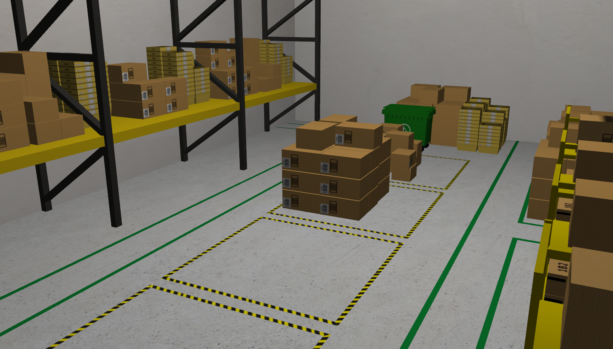
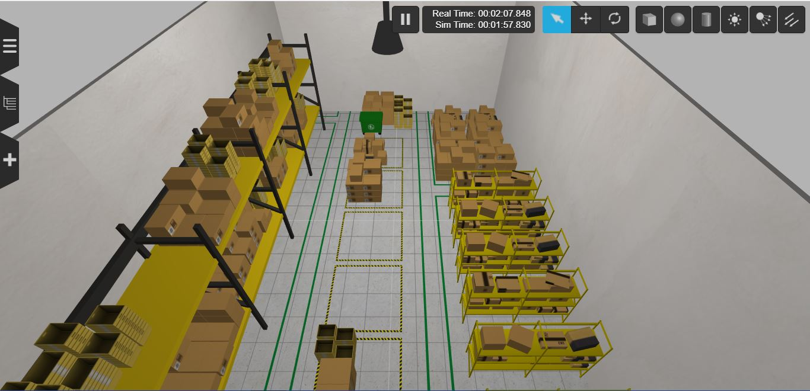
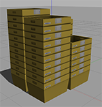
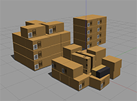
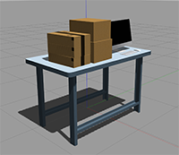
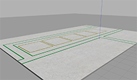
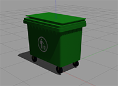
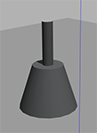
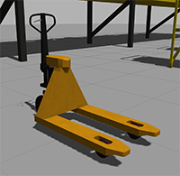
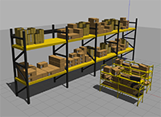

# AWS RoboMaker Small Warehouse World



## AWS Robomaker Small Warehouse World on Gzweb



This Gazebo world is well suited for organizations who are building and testing robot applications for warehouse and logistics use cases. 

## 3D Models included in this Gazebo World

| Model (/models)       | Picture           |
| :------------- |:-------------:|
| **aws_robomaker_warehouse_Bucket_01**    | 
| **aws_robomaker_warehouse_ClutteringA_01, aws_robomaker_warehouse_ClutteringC_01, aws_robomaker_warehouse_ClutteringD_01**     |  |
| **aws_robomaker_warehouse_DeskC_01**    | 
| **aws_robomaker_warehouse_GroundB_01**    | 
| **aws_robomaker_warehouse_TrashCanC_01**   | 
| **aws_robomaker_warehouse_Lamp_01**    | 
| **aws_robomaker_warehouse_PalletJackB_01**    | 
| **aws_robomaker_warehouse_ShelfD_01, aws_robomaker_warehouse_ShelfE_01, aws_robomaker_warehouse_ShelfF_01**    | 

## Building and Launching the Gazebo World with your ROS Applications

* Create or update a **.rosinstall** file in the root directory of your ROS workspace. Add the following line to **.rosintall**:
    ```
    - git: {local-name: src/aws-robomaker-small-warehouse-world, uri: 'https://github.com/aws-robotics/aws-robomaker-small-warehouse-world.git', version: master}
    ```
* Change the directory to your ROS workspace and run `rosws update`

* Add the following include to the ROS launch file you are using:
    ```xml
    <launch>
    <!-- Launch World -->
    <include file="$(find aws_robomaker_small_warehouse_world)/launch/small_warehouse.launch"/>
    ...
    </launch>
    ```

* Build your application using `colcon`
    ```bash
    rosws update
    rosdep install --from-paths . --ignore-src -r -y
    colcon build
    ```

## Example: Running this world directly in Gazebo without a ROS application

To open this world in Gazebo, change the directory to your ROS workspace root folder and run:

```bash
cd aws-robomaker-small-warehouse-world
export GAZEBO_MODEL_PATH=`pwd`/models
gazebo worlds/small_warehouse.world
```

## Example: Running this world on Gazebo headless and running the UI on Gzweb
*Tested in ROS Kinetic/Melodic, Gazebo 7/9 with node version 8.11.3/10.22.1*

To open this world in Gzweb, There are two steps,

1) In a terminal, change  to your ROS workspace root folder and run gzserver with the small warehouse world:

```bash
cd aws-robomaker-small-warehouse-world
export GAZEBO_MODEL_PATH=`pwd`/models
gzserver worlds/small_warehouse.world
```

2) In another terminal, setup and run GzWeb
- Install GzWeb by following the [official documentation](http://gazebosim.org/gzweb#install-collapse-1):

    **Important**:
  * The recommended NodeJS versions are 4 up to version 8.  
  * Watch out for [conflicting installations of Node/NodeJS](https://askubuntu.com/questions/695155/node-nodejs-have-different-version)
  * See [Troubleshooting section](http://gazebosim.org/gzweb#install-collapse-3) for other issues
  
- Deploy GzWeb
    - Approach 1: Copy all the Gazebo models from small-warehouse world to gzweb/http/client/assets/, and run the deploy script

    ```bash
    cp -r ~/aws-robomaker-small-warehouse-world/models/. ~/gzweb/http/client/assets
    cd ~/gzweb
    export GAZEBO_MASTER_URI="http://localhost:11345" # change localhost to IP address of the gzserver machine
    npm run deploy
    npm start
    ```

    - Approach 2: without copying the Gazebo models, export Gazebo model path and run the deploy script with `-m local`

    ```bash
    cd aws-robomaker-small-warehouse-world
    export GAZEBO_MODEL_PATH=`pwd`/models
    cd ~/gzweb
    export GAZEBO_MASTER_URI="http://localhost:11345" # change localhost to IP address of the gzserver machine
    npm run deploy --- -m local
    npm start
    ```

## Example: Running this world directly using ROS without a simulated robot

To launch this base Gazebo world without a robot, clone this repository and run the following commands. **Note: ROS and gazebo must already be installed on the host.** 

```bash
# build for ROS
rosdep install --from-paths . --ignore-src -r -y
colcon build

# run in ROS
source install/setup.sh
roslaunch aws_robomaker_small_warehouse_world view_small_warehouse.launch
```
**Visit the [AWS RoboMaker website](https://aws.amazon.com/robomaker/) to learn more about building intelligent robotic applications with Amazon Web Services.**

## Notes
- Lighting might vary on different system(s) (e.g brighter on system without CPU and darker on system with GPU)
- Adjust lighting parameters in .world file as you need

## 中文翻译

# AWS RoboMaker 小型仓库世界

这是一个用于 Gazebo 的 AWS RoboMaker 小型仓库场景，适合构建和测试仓储、物流机器人应用。文档中的图片展示了 Gazebo 和 GzWeb 中的场景效果，模型表列出了仓库中可用的货架、箱体、桌子、地面、垃圾桶、灯具和托盘车等模型。

在 ROS 应用中使用时，需要在工作空间维护 .rosinstall，执行 rosws update 获取世界包，在 Launch 文件中包含 small_warehouse.launch，并通过 rosdep install 和 colcon build 安装依赖、编译应用。直接运行 Gazebo 时设置 GAZEBO_MODEL_PATH 后启动 small_warehouse.world；无界面运行使用 gzserver，GzWeb 在另一个终端提供可视化界面。光照效果可能随硬件变化，可按需要调整 world 文件中的光照参数。
